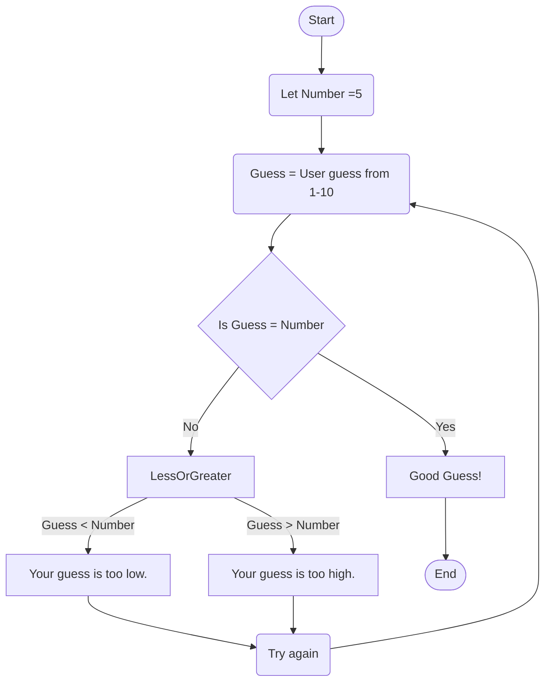

# Guessing Game Flowchart

## Documentation 
### Steps:
1. The game starts and we assign a random number from 1 to 10. (in this case 5) to **"Number"**
2. **"Guess"** is assigned to whatever the user inputs as their guess. To narrow down the options, we ask for a number from 1 to 10. 
3. We check if _Guess_ is equal to _Number_. 
4. If **_YES_**, then we state "Good Guess!" end the game. 
5. If **_NO_**, we go to checking if it is **Less or Greater** than the Number. 
    * If the Guess is less than the Number, we state that the Guess is too low.
    * If the Guess is more than the Number, we state that the Guess is too high. 
6. After providing feedback if the guess is too low or too high, we state "Try Again" and the user is allowed to input another number.
7. This process will repeat until the user correctly inputs the correct number. Again, to make it less complicated, the Number will be from 1 to 10. 