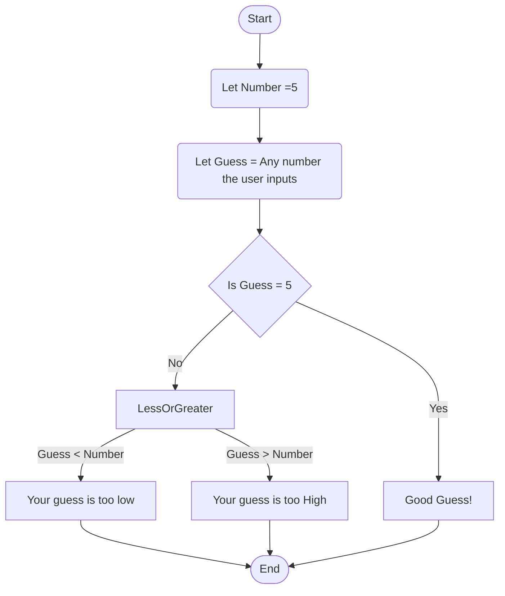

```mermaid 
flowchart TD
    Start([Start]) -->  Assign("Let Number =5")
    Assign --> Assume("Let Guess = Any number the user inputs")
    Assume --> Check{"Is Guess = 5"}
    Check --> |Yes| Correct["Good Guess!"]
    Check --> |No| LessOrGreater 
    LessOrGreater --> |Guess < Number| TooLow["Your guess is too low"]
    LessOrGreater --> |Guess > Number| TooHigh["Your guess is too High"]
    TooLow -->End([End])
    TooHigh -->End([End])
    Correct -->End([End])
```