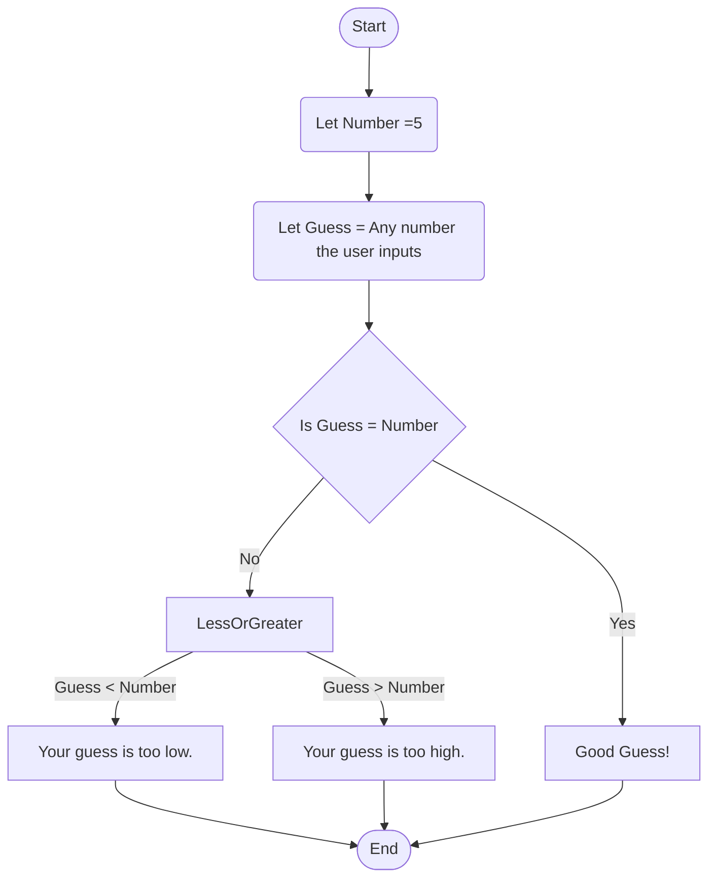

# Guessing Game Flowchart

## Documentation 
### Steps:
1. The game starts and we assign a random number (in this case 5) to **"Number"**
2. **"Guess"** is assigned to whatever the user inputs as their guess 
3. We check if _Guess_ is equal to _Number_. 
4. If **_YES_**, then we state "Good Guess!" end the game. 
5. If **_NO_**, we go to checking if it is **Less or Greater** than the Number. 
    * If the Guess is less than the Number, we state that the Guess is too low.
    * If the Guess is more than the Number, we state that the Guess is too high. 
6. After providing feedback, the game ends. 